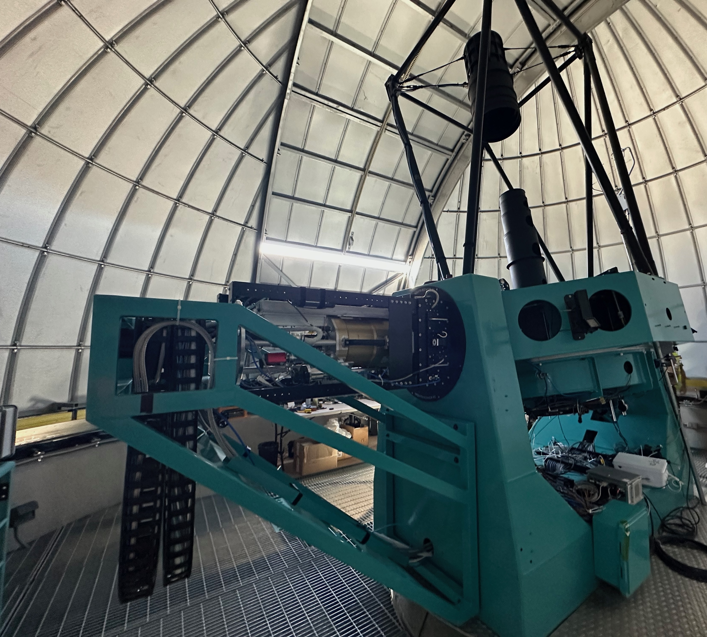

:og:description: LATISS is the LSST Atmospheric Transmission Imager and Slitless Spectrograph, a calibration instrument at the Vera C. Rubin Observatory.

########################################################################
LATISS -- LSST Atmospheric Transmission Imager and Slitless Spectrograph
########################################################################

DOI: Not Yet Published

.. important::

   This website is currently under development.

LATISS, the LSST Atmospheric Transmission Imager and Slitless Spectrograph, is installed on the Rubin Auxiliary Telescope, a 1.2-meter telescope dedicated to atmospheric characterization at the NSF-DOE Vera C. Rubin Observatory site.
It uses a 4k x 4k CCD, made by `ITL <https://www.itl.arizona.edu/capabilities>`_, of the same type as used on `LSSTCam <https://lsstcam.lsst.io>`_.
It is designed to measure atmospheric transmission and calibrate LSST observations by taking spectra of standard stars.

Additional information:

* `LATISS Instrument Handbook <https://tstn-006.lsst.io>`_, Mondrik, Ingraham, and Brownsbuger (2019; Vera C. Rubin Observatory Telescope and Site Technical Note TSTN-006)
* `Vera C. Rubin Observatory auxiliary telescope commissioning as a control system pathfinder <https://ui.adsabs.harvard.edu/abs/2020SPIE11452E..0UI/abstract>`_, Ingraham et al. (2020; SPIE, `doi:10.1117/12.2561112 <https://doi.org/10.1117/12.2561112>`_)

This material is based upon work supported in part by the National Science Foundation through Cooperative Agreement AST-1258333 and Cooperative Support Agreement AST-1202910 managed by the Association of Universities for Research in Astronomy (AURA), and the Department of Energy under Contract No. DE-AC02-76SF00515 with the SLAC National Accelerator Laboratory managed by Stanford University.
Additional Rubin Observatory funding comes from private donations, grants to universities, and in-kind support from LSSTC Institutional Members.
